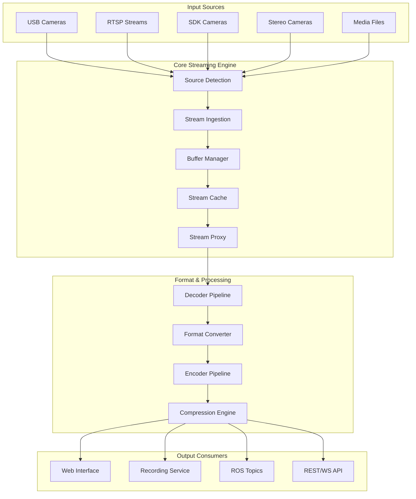

# Camera Stream Proxy - System Architecture

## Executive Summary

The Camera Stream Proxy is a high-performance, low-latency streaming system designed to aggregate multiple camera sources and distribute streams to various consumers with intelligent caching and format conversion capabilities.

## System Overview

## Core Components

### 1. Stream Ingestion Layer

**Technology**: Rust + GStreamer
**Responsibility**: Detect, connect, and manage input streams

#### Components:
- **Source Discovery Service**: Auto-detect available cameras and streams
- **Connection Pool Manager**: Maintain persistent connections to sources
- **Stream Health Monitor**: Monitor source availability and quality
- **Metadata Extractor**: Extract stream properties (resolution, framerate, codec)

#### Key Features:
- Hot-pluggable source detection
- Connection retry with exponential backoff
- Stream quality metrics collection
- Automatic failover for redundant sources

### 2. Buffer & Cache Management

**Technology**: Rust with zero-copy optimizations
**Responsibility**: Efficient memory management and stream caching

#### Components:
- **Ring Buffer Manager**: Circular buffers for real-time streams
- **Frame Cache**: LRU cache for frequently accessed frames
- **Memory Pool**: Pre-allocated buffer pools to reduce GC pressure
- **Compression Manager**: On-the-fly compression for storage efficiency

#### Key Features:
- Configurable buffer sizes per stream
- Memory-mapped file backing for large caches
- Frame deduplication for static scenes
- Adaptive compression based on content

### 3. Stream Proxy & Distribution

**Technology**: Rust + async runtime (Tokio)
**Responsibility**: Distribute streams to multiple consumers efficiently

#### Components:
- **Stream Multiplexer**: Fan-out streams to multiple consumers
- **Load Balancer**: Distribute load across processing instances
- **Rate Limiter**: Control stream consumption rates
- **Format Negotiator**: Match optimal formats between sources and consumers

#### Key Features:
- Zero-copy stream distribution where possible
- Backpressure handling for slow consumers
- Dynamic quality adaptation
- Consumer priority management

### 4. Format Conversion Engine

**Technology**: C++ with GStreamer pipelines
**Responsibility**: Real-time format conversion and transcoding

#### Components:
- **Codec Manager**: Hardware-accelerated encoding/decoding
- **Pipeline Builder**: Dynamic GStreamer pipeline creation
- **Filter Chain**: Configurable processing filters
- **Quality Controller**: Adaptive bitrate and quality control

#### Key Features:
- Hardware acceleration (NVENC, VAAPI, Quick Sync)
- Dynamic pipeline reconfiguration
- Multi-threaded processing
- Quality metrics feedback loop

### 5. Configuration & Management Layer

**Technology**: Go + Python
**Responsibility**: System configuration and stream management

#### Components:
- **Config Manager**: YAML-based configuration with hot-reload
- **Stream Router**: Dynamic routing rules for streams
- **Policy Engine**: Access control and resource limits
- **Monitoring Agent**: System metrics and alerting

#### Key Features:
- Environment-specific configurations
- Dynamic stream routing
- Resource quotas and limits
- Real-time configuration updates

### 6. API & Web Interface

**Technology**: Go (API) + React/TypeScript (Web)
**Responsibility**: External interfaces and user interactions

#### Components:
- **REST API**: Stream management and configuration
- **WebSocket Gateway**: Real-time stream delivery
- **Web Player**: Browser-based stream viewer
- **Admin Dashboard**: System monitoring and control

#### Key Features:
- OpenAPI specification
- Real-time stream preview
- Multi-stream viewing
- System health dashboard

### 7. ROS Integration

**Technology**: Python + ROS2
**Responsibility**: Integration with robotics systems

#### Components:
- **ROS Bridge**: Convert streams to ROS messages
- **Topic Publisher**: Publish compressed image topics
- **Service Interface**: ROS service for stream control
- **Parameter Server**: ROS parameter integration

#### Key Features:
- Multiple ROS message formats (sensor_msgs/Image, sensor_msgs/CompressedImage)
- Dynamic topic creation
- QoS configuration
- Synchronized multi-camera publishing

## Data Flow Architecture

### Stream Processing Pipeline

1. **Source Detection**
   - Scan for available sources
   - Validate connection parameters
   - Register source metadata

2. **Stream Ingestion**
   - Establish source connections
   - Create ingestion threads
   - Initialize buffer pools

3. **Buffer Management**
   - Allocate ring buffers
   - Implement frame caching
   - Monitor memory usage

4. **Format Processing**
   - Decode input streams
   - Apply processing filters
   - Encode output formats

5. **Stream Distribution**
   - Multiplex to consumers
   - Handle backpressure
   - Monitor delivery metrics

6. **Consumer Delivery**
   - Format-specific delivery
   - Rate limiting
   - Quality adaptation

## Scalability Design

### Horizontal Scaling
- **Microservice Architecture**: Independent scaling of components
- **Load Balancing**: Distribute streams across instances
- **Service Discovery**: Dynamic service registration
- **Circuit Breakers**: Prevent cascade failures

### Vertical Scaling
- **Multi-threading**: Parallel stream processing
- **Hardware Acceleration**: GPU-accelerated encoding/decoding
- **Memory Optimization**: Zero-copy operations
- **CPU Affinity**: Optimize thread scheduling

## Performance Requirements

### Latency Targets
- **Glass-to-Glass**: < 100ms for local streams
- **Processing Overhead**: < 20ms per transformation
- **Network Latency**: < 30ms for local network
- **Buffer Latency**: < 10ms for real-time streams

### Throughput Targets
- **Concurrent Streams**: 50+ simultaneous 1080p streams
- **4K Streams**: 10+ simultaneous 4K streams
- **Total Bandwidth**: 10+ Gbps aggregate throughput
- **Processing Rate**: 1000+ fps across all streams

### Resource Utilization
- **CPU**: < 80% utilization under normal load
- **Memory**: Configurable limits with graceful degradation
- **Network**: Adaptive bandwidth utilization
- **Storage**: Efficient caching with TTL management

## Reliability & Resilience

### Fault Tolerance
- **Source Failures**: Automatic reconnection with backoff
- **Processing Failures**: Graceful degradation of quality
- **Network Failures**: Local caching and retry mechanisms
- **System Failures**: Health checks and automatic recovery

### Monitoring & Alerting
- **Stream Health**: Monitor frame rates, latency, errors
- **System Health**: CPU, memory, network, storage metrics
- **Service Health**: Component availability and performance
- **Custom Metrics**: Application-specific monitoring

### Backup & Recovery
- **Configuration Backup**: Automated config snapshots
- **Stream Recording**: Automatic recording for critical streams
- **State Recovery**: Graceful restart with state preservation
- **Disaster Recovery**: Multi-site deployment capabilities

## Security Considerations

### Authentication & Authorization
- **API Security**: JWT-based authentication
- **Stream Access**: Role-based access control
- **Admin Interface**: Multi-factor authentication
- **Service-to-Service**: mTLS for internal communication

### Data Protection
- **Stream Encryption**: TLS/DTLS for network streams
- **Storage Encryption**: Encrypted cache and recordings
- **Key Management**: Secure key rotation
- **Privacy Controls**: Configurable data retention

### Network Security
- **Firewall Rules**: Restrictive network policies
- **VPN Integration**: Secure remote access
- **Rate Limiting**: DDoS protection
- **Intrusion Detection**: Monitor for suspicious activity 